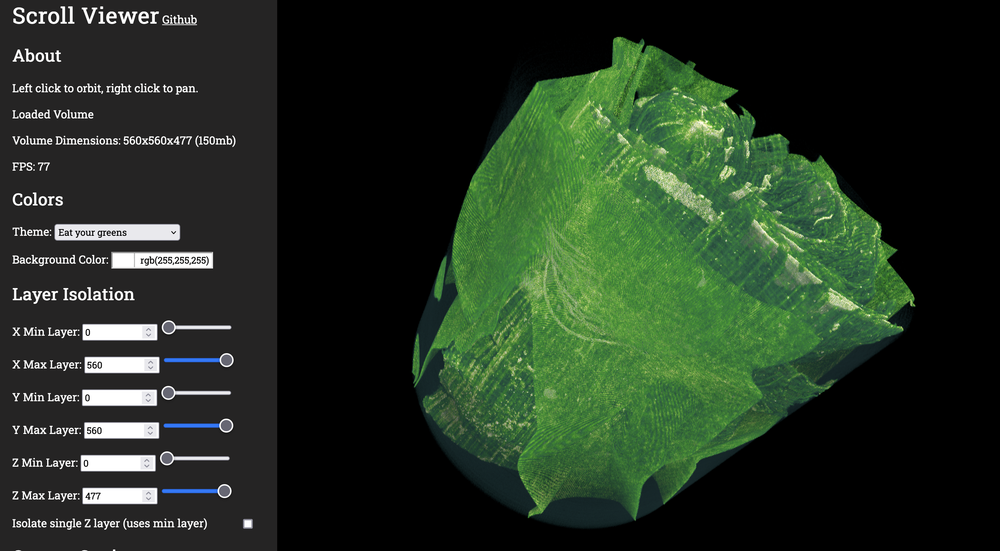

# Scroll Viewer

This is a web-based volumetric renderer for use in the [Vesuvius Challenge](https://scrollprize.org/). Currently supports viewing the campfire scroll with fast, webgl-based rendering, color themes, and layer isolation features. 

Contributions are most welcome! Some future plans for the project:
- View larger scrolls (ie the fragments) via progressive loading and level of detail
- View ground-truth segmentations
- Annotate scroll layers and virtually unwrap (this can be done in-browser via webgl magic)
- Integrate with your custom ink detection backends
- Cloud hosted version of the tool so no downloads are required to view the campfire scroll

## Usage Instructions
1. Clone this repository
2. Due to size restrictions, the campfire scroll data isn't included in this repository. Download the campfire.zip from [here](https://scrollprize.org/data)
3. Unzip campfire.zip and place it in the home directory of this repository
4. Run the conversion script with `python converttoraw.py`. This converts the campfire scroll data into an 8-bit 3d texture file, which can be loaded into the scroll viewer. You may need to adjust the `input_directory` variable of the script.
5. Run the scroll viewer with any http server. I recommend `python -m http.server 8000`, which can be accessed at `localhost:8000` in your web browser.
6. If you have any issues at all, please don't hesistate to open an issue ticket, reach out on the [Vesuvius Challenge Discord](https://discord.gg/6FgWYNjb4N) or contact me [on twitter](https://twitter.com/LukeFarritor). I'm here to help!

Volumetric rendering is well-explored problem with countless implementations on the internet. I'm using [webgl-volume-raycaster](https://github.com/Twinklebear/webgl-volume-raycaster) as a boilerplate. That repo includes [a great tutorial](https://www.willusher.io/webgl/2019/01/13/volume-rendering-with-webgl) on the basics of volumetric rendering which I highly recommend to all who want to learn more.
